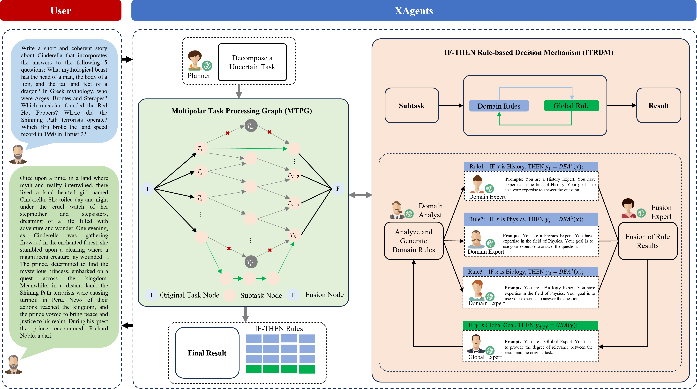

<h1 align="center">
XAgents: A Unified Framework for Multi-Agent Cooperation viaIF-THEN Rules and Multi-Polar Task Processing Graph
</h1>
<p align="center">


</p>

<p align="center">
 <br>
Figure 1. Structure of XAgents.
</p>


## Conda Enviroment Setup

``` shell
conda create --name fuzzys2s --file ./requirements.txt
conda activate fuzzys2s
```

## Datasets

**Task1.Trivia Creative Writing.** The task tests LLMs' ability to retrieve and integrate diverse
information from their internal knowledge. In this task, a model must craft a coherent story around a
given topic while incorporating answers to 𝑁 trivia questions. We evaluate the models with 𝑁 set to 5
and 10, where a higher 𝑁 requires more extensive domain knowledge. Our benchmark includes 100
instances for each 𝑁, totaling 1,000 trivia questions.

**Task2. Logic Grid Puzzle.** The task is from the Bigbench dataset, which comprises 200 instances.
Each instance describes a logic puzzle involving 2 to 5 houses, each occupied by a person with specific
characteristics, such as playing the piano. The goal is to answer questions about house numbers based
on given clues, requiring multi-step reasoning and the selection of relevant information. For evaluation,
we measure the accuracy of the predicted house numbers by comparing them to the ground truth targets
provided by the dataset.

**Task3. Codenames Collaborative.** The task is an extension of the Codenames task from the BigBench.
Codenames Collaborative is a collaborative task that examines a model’s knowledge, reasoning, and
theory of mind abilities by assigning two player roles: the Spymaster and the Guesser. The Spymaster’s
role is to provide a hint word related to the target words, excluding some other distractor words, while
the Guesser’s role is to identify the target words based on the given hint and the full list of words.

The three datasets are publicly accessible in https://github.com/MikeWangWZHL/Solo-PerformancePrompting/tree/main/data (SPP project). These data does not contain any information that names or
uniquely identifies individual people or offensive content. The datasets are only for test. Trivia
Creative Writing has 100 samples (N=5) and 100 samples (N=10). Logic Grid Puzzle has 200
samples. Codenames Collaborative has 50 samples.

## Run and Test


